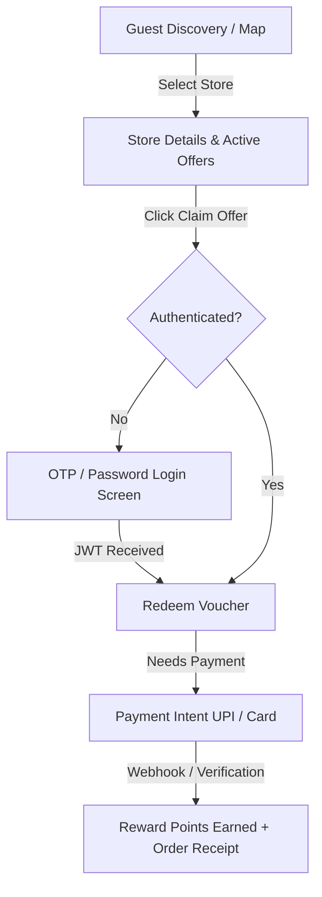
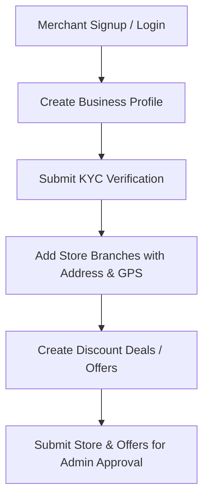

# Merchant Discovery Super-App — Frontend API Integration Guide

This guide describes how to connect frontend applications (React, Next.js, React Native, Vue, Flutter) to the live Spring Boot backend APIs using the workflow-arranged Postman collection.

---

## 1. Quick Start & Postman Collection

The repository includes a ready-to-import Postman collection:
📁 **[`Merchant_Discovery_SuperApp.postman_collection.json`](./Merchant_Discovery_SuperApp.postman_collection.json)**

### How to Import into Postman:
1. Open **Postman** ➔ Click **Import** (top left).
2. Drag and drop `Merchant_Discovery_SuperApp.postman_collection.json`.
3. The collection is already pre-configured with:
   * **`baseUrl`**: `https://pinak-server-6.onrender.com` *(Live Render Backend)*
   * **`localBaseUrl`**: `http://localhost:8080` *(For local backend testing)*
4. **Auto-Token Capture**: When you run any login or register request, the returned `accessToken`, `refreshToken`, and user IDs are **automatically saved** into collection variables. You do not need to copy-paste tokens manually!

---

## 2. API Architecture & Standards

### Base URLs
* **Production / Staging (Render HTTPS)**: `https://pinak-server-6.onrender.com/api/v1`
* **Local Development**: `http://localhost:8080/api/v1`

### Authentication Standard
All authenticated requests must include the Bearer token in the `Authorization` HTTP header:
```http
Authorization: Bearer <accessToken>
```

### Standard API Response Envelope
Every API response returns a uniform JSON contract:

#### Success Response (`HTTP 200 / 201`):
```json
{
  "success": true,
  "message": "Operation successful",
  "data": { ... },
  "requestId": "0df3c1b8-570c-4515-b83f-eb23647d2271"
}
```

#### Error Response (`HTTP 400 / 401 / 403 / 404 / 409 / 500`):
```json
{
  "success": false,
  "message": "Human-readable error explanation",
  "errorCode": "INVALID_CREDENTIALS",
  "error": {
    "code": "INVALID_CREDENTIALS",
    "details": null
  },
  "requestId": "0df3c1b8-570c-4515-b83f-eb23647d2271"
}
```

---

## 3. Workflow Modules Overview

The Postman collection is organized into **4 primary workflows** representing the 3 frontend portals:

```text
Collection
 ├── 📱 1. Customer App Workflow (Mobile / Web)
 │    ├── 1.1 Public Discovery & Store Search (Unauthenticated landing & maps)
 │    ├── 1.2 Customer Authentication & Sessions (OTP, login, register)
 │    ├── 1.3 Customer Profile & Security (Profile, active sessions)
 │    ├── 1.4 Offer Redemption & Checkout (Voucher claiming, payments)
 │    ├── 1.5 Wallet, Rewards & History (Point balance, ledger, transactions)
 │    └── 1.6 Notifications & Preferences (In-app notifications)
 │
 ├── 🏪 2. Merchant Portal Workflow (Partner Dashboard)
 │    ├── 2.1 Merchant Onboarding & Auth (Partner signup/login)
 │    ├── 2.2 Business Profile & KYC Verification (Brand info, documents)
 │    ├── 2.3 Store Branches & Locations (Physical store branches, GPS)
 │    ├── 2.4 Offer Creation & Management (Promotional deals, discounts)
 │    └── 2.5 Store Redemptions & Transactions (Redemption tracking, sales)
 │
 ├── 🛡️ 3. Admin Back-Office Portal Workflow (Internal Operations)
 │    ├── 3.1 Secure Admin Auth & 2FA (2-step login with MFA verification)
 │    ├── 3.2 Master Data Management (Categories & Cities CRUD)
 │    ├── 3.3 Merchant Approval & KYC Moderation (Approve/Reject merchants)
 │    ├── 3.4 Store Branch Approval Workflow (Approve/Reject stores)
 │    ├── 3.5 Offer Approval & Moderation (Approve/Reject promotional deals)
 │    └── 3.6 User Management, Audits & Rewards (Users, audits, points)
 │
 └── ⚙️ 4. Health & System Probes
      └── 4.1 Health Check & OpenAPI 3.0 Documentation
```

---

## 4. Step-by-Step Frontend Screen Workflows

### 📱 Workflow 1: Customer App Flow



#### Screen 1: Home / Nearby Store Map
* **Call**: `GET /api/v1/discovery/nearby?lat=21.1458&lng=79.0882&radiusKm=10`
* **Displays**: Nearby stores with distance, address, and category badge.
* **Categories Filter**: `GET /api/v1/discovery/categories`
* **Cities Selector**: `GET /api/v1/discovery/cities`

#### Screen 2: Store Detail & Offers
* **Call**: `GET /api/v1/discovery/stores/{storeId}`
* **Call**: `GET /api/v1/discovery/stores/{storeId}/offers`
* **Displays**: Store address, operating hours, phone, and list of approved offers.

#### Screen 3: Customer Login / Signup
* **Password Login (Email OR Phone Number)**: `POST /api/v1/auth/login`
  - Users can enter whichever they feel comfortable with (email or phone):
  ```json
  // Option A: Email login
  { "email": "customer@superapp.com", "password": "Customer@123456" }

  // Option B: Phone number login
  { "phone": "+919876543210", "password": "Customer@123456" }

  // Option C: Generic identifier
  { "identifier": "customer@superapp.com", "password": "Customer@123456" }
  ```
* **Phone OTP Flow**:
  1. `POST /api/v1/auth/otp/send` (Body: `phone`) ➔ Returns `otpRequestId`.
  2. `POST /api/v1/auth/otp/verify` (Body: `phone`, `otp`, `otpRequestId`) ➔ Returns `accessToken` and `refreshToken`.

#### Screen 4: Claiming an Offer
* **Call**: `POST /api/v1/redemptions` (Body: `offerId`, `storeId`)
* **Returns**: `redemptionId`, `status: "PENDING"` or `"COMPLETED"`.

#### Screen 5: Payment (If Offer Requires Payment)
* **Call**: `POST /api/v1/payments/intent` (Body: `amount`, `paymentMethod: "UPI"`, `storeId`, `redemptionId`)
* **Returns**: `paymentId`, `paymentReference`, UPI deep link / QR payload.

#### Screen 6: Wallet, Rewards & Notifications
* **Wallet Balance**: `GET /api/v1/rewards/balance`
* **Rewards Ledger**: `GET /api/v1/rewards/ledger`
* **Receipts History**: `GET /api/v1/transactions`
* **Notifications Bell**: `GET /api/v1/notifications/unread-count`

---

### 🏪 Workflow 2: Merchant Partner Dashboard



#### Screen 1: Merchant Auth & Business Profile
* **Signup**: `POST /api/v1/auth/register` (Role: `MERCHANT`)
* **Login**: `POST /api/v1/auth/login`
* **Create Business**: `POST /api/v1/merchant/profile` (Body: `businessName`, `categoryId`)
* **Submit KYC**: `POST /api/v1/merchant/kyc` (Body: `panNumber`, `gstin`, `idDocumentUrl`)

#### Screen 2: Managing Store Branches (Locations)
* **Create Branch**: `POST /api/v1/merchant/stores` (Body: `storeName`, `address`, `cityId`, `state`, `pincode`, `latitude`, `longitude`, `phone`)
* **List Branches**: `GET /api/v1/merchant/stores`
* **Submit for Approval**: `POST /api/v1/merchant/stores/{storeId}/submit`

#### Screen 3: Creating & Managing Offers
* **Create Deal**: `POST /api/v1/merchant/offers` (Body: `title`, `description`, `storeIds`, `discountPercent`, `startDate`, `endDate`)
* **Submit Deal**: `POST /api/v1/merchant/offers/{offerId}/submit`

#### Screen 4: Redemptions & Sales
* **View Customer Redemptions**: `GET /api/v1/merchant/stores/{storeId}/redemptions`
* **Store Sales Transactions**: `GET /api/v1/merchant/stores/{storeId}/transactions`

---

### 🛡️ Workflow 3: Admin Back-Office Portal

#### Screen 1: Secure 2-Step Login (With MFA Challenge)
1. `POST /api/v1/admin/auth/login` (Body: `email`, `password`)
   * Response: `{"success": true, "data": {"mfaRequired": true, "challengeId": "..."}}`
2. `POST /api/v1/admin/auth/mfa-verify` (Body: `challengeId`, `code`)
   * Response: Returns `accessToken` with `ROLE_ADMIN`.

#### Screen 2: Dashboard Metrics & Approvals
* **Dashboard Summary**: `GET /api/v1/admin/dashboard`
* **Approve Merchant**: `POST /api/v1/admin/merchants/{merchantId}/approve`
* **Approve Store**: `POST /api/v1/admin/stores/{storeId}/approve`
* **Approve Offer**: `POST /api/v1/admin/offers/{offerId}/approve`

---

## 5. Frontend Client Implementation (Axios with Auto-Refresh)

Here is a recommended TypeScript Axios interceptor pattern for handling authentication and token refresh automatically:

```typescript
import axios from 'axios';

const API_BASE_URL = process.env.NEXT_PUBLIC_API_URL || 'https://pinak-server-6.onrender.com/api/v1';

export const apiClient = axios.create({
  baseURL: API_BASE_URL,
  headers: {
    'Content-Type': 'application/json',
  },
});

// 1. Request Interceptor: Attach JWT Bearer Token
apiClient.interceptors.request.use((config) => {
  const token = localStorage.getItem('accessToken');
  if (token) {
    config.headers.Authorization = `Bearer ${token}`;
  }
  return config;
});

// 2. Response Interceptor: Auto-Refresh on 401 Unauthorized
apiClient.interceptors.response.use(
  (response) => response,
  async (error) => {
    const originalRequest = error.config;
    if (error.response?.status === 401 && !originalRequest._retry) {
      originalRequest._retry = true;
      const refreshToken = localStorage.getItem('refreshToken');
      if (refreshToken) {
        try {
          const res = await axios.post(`${API_BASE_URL}/auth/token/refresh`, {
            refreshToken,
          });
          const newAccessToken = res.data.data.accessToken;
          localStorage.setItem('accessToken', newAccessToken);
          originalRequest.headers.Authorization = `Bearer ${newAccessToken}`;
          return apiClient(originalRequest);
        } catch (refreshErr) {
          localStorage.removeItem('accessToken');
          localStorage.removeItem('refreshToken');
          window.location.href = '/login';
        }
      }
    }
    return Promise.reject(error);
  }
);
```

---

## 6. Seed Test Accounts for Frontend Testing

| Persona | Email | Password | Role |
| :--- | :--- | :--- | :--- |
| **Customer** | `customer@superapp.com` | `Customer@123456` | `CUSTOMER` |
| **Merchant** | `vendor@superapp.com` | `Vendor@123456` | `MERCHANT` |
| **Admin** | `admin@superapp.com` | `Admin@123456` | `ADMIN` |
| **Super Admin** | `superadmin@superapp.com` | `Superadmin@123456` | `SUPER_ADMIN` |
